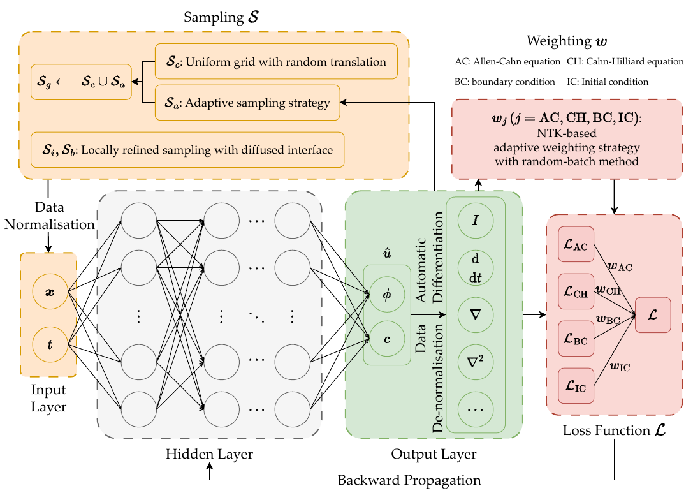
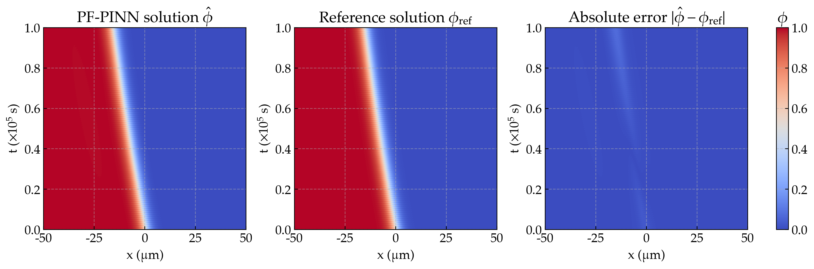
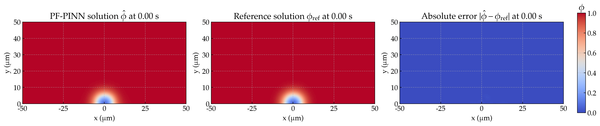
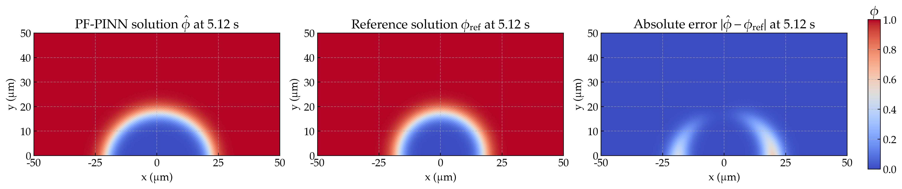
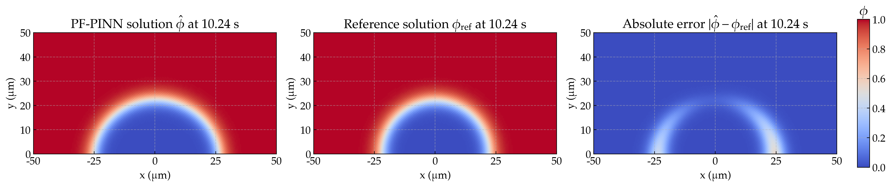
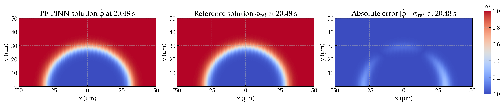
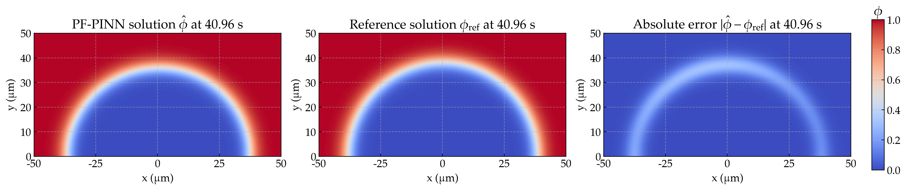
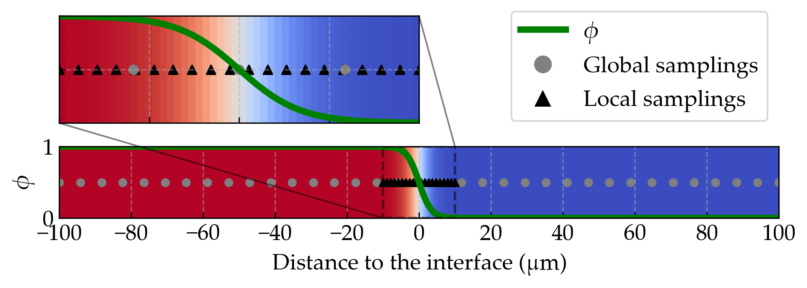
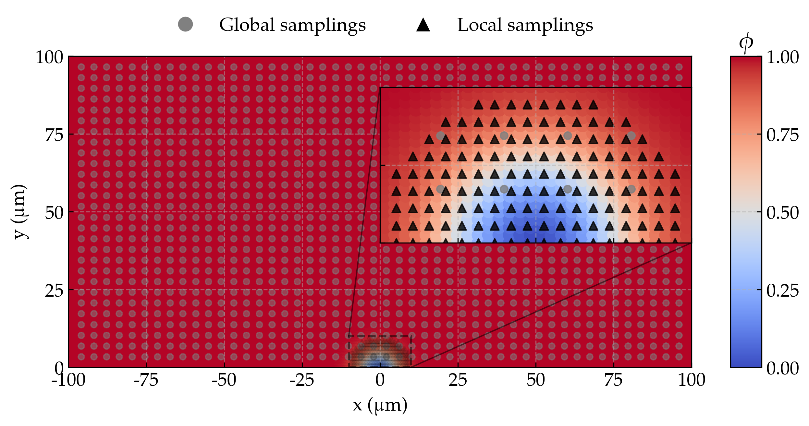

# PF-PINNs

This repository contains the code for the paper "Pf-Pinns: Physics-Informed Neural Networks for Solving Coupled Allen-Cahn and Cahn-Hilliard Phase Field Equations". We introduce a physics-informed neural network (PINN) framework for solving coupled Allen-Cahn and Cahn-Hilliard phase field equations.

## Overview




## Representative Results

### 1d corrosion 

<!--  -->


### 2d corrosion
<!-- 



 -->


## Methodology

### Local refinement for initial conditions

<!-- 
 -->


### NTK-based adaptive weighting strategy

Jacobi matrix for the residuals w.r.t. the network parameters:

$$\boldsymbol{J}_\text{AC}(s) = \frac{\partial {\hat{\boldsymbol{\mathcal{G}}}}{\text{AC}}(s)}{\partial \boldsymbol{\theta}}$$

$$\boldsymbol{J}_\text{CH}(s) = \frac{\partial {\hat{\boldsymbol{\mathcal{G}}}}{\text{CH}}(s)}{\partial \boldsymbol{\theta}}$$

$$\boldsymbol{J}_\text{IC}(s) = \frac{\partial {\hat{\boldsymbol{\mathcal{I}}}}(s)}{\partial \boldsymbol{\theta}}$$

$$\boldsymbol{J}_\text{BC}(s) = \frac{\partial {\hat{\boldsymbol{\mathcal{B}}}}(s)}{\partial \boldsymbol{\theta}}$$

NTK matrices corresponding to the residuals:

$$\boldsymbol K_j = \boldsymbol J_j(s)\boldsymbol J_j(s)^T$$

Weighting coefficients based on the random-batched NTK matrices:

$$w_j(s) = \frac{b_{j}}{\text{tr}(\boldsymbol K_{j, r}(s))}\left[\frac{\text{tr}(\boldsymbol K_{\text{AC}, r}(s))}{b_{\text{AC}}}+ \frac{\text{tr}(\boldsymbol K_{\text{CH}, r}(s))}{b_{\text{CH}}}+ \frac{\text{tr}(\boldsymbol K_{\text{IC}, r}(s))}{b_{\text{IC}}}+ \frac{\text{tr}(\boldsymbol K_{\text{BC}, r}(s))}{b_{\text{BC}}}\right]$$

where $K_{j, r}$ is the NTK matrix of randomly sampled points set $\mathcal{S}_{j, b_j}$, $b_j$ is the batch size for the $j$-th residual.


## Configs

### 1d-activation driven

```ini
[PARAM]
ALPHA_PHI = 9.62e-5
OMEGA_PHI = 1.663e7
DD = 8.5e-10
AA = 5.35e7
LP = 1e-11
CSE = 1.
CLE = 5100/1.43e5

[TRAIN]
DIM = 1
DRIVEN = "activation"
GEO_COEF = 1e4
TIME_COEF = 1e-5
TIME_SPAN = (0, 1)
GEO_SPAN = (-0.5, 0.5)
REF_PATH = ./data/results-fenics-active.csv
ALPHA = 1.0
LR = 1e-3
RESUME = None


NETWORK_SIZE = [2] + [16]*4 + [2]
NTK_BATCH_SIZE = 32
NTK_MODE = "mini"
BREAK_INTERVAL = 100
EPOCHS = 4000
GEOTIME_SHAPE = [10, 10]
BCDATA_SHAPE = 64
ICDATA_SHAPE = 64
SAMPLING_STRATEGY = ["grid_transition"] * 3
RAR_BASE_SHAPE = 5000
RAR_SHAPE = 512
ADAPTIVE_SAMPLING = "rar"

LOG_NAME = "1da-case-4-5"
```

### 1d-diffusion driven
 
```ini

[PARAM]
ALPHA_PHI = 9.62e-5
OMEGA_PHI = 1.663e7
DD = 8.5e-10
AA = 5.35e7
LP = 2.0
CSE = 1.
CLE = 5100/1.43e5

[TRAIN]
DIM = 1
DRIVEN = "diffusion"
GEO_COEF = 1e4
TIME_COEF = 1e-2
TIME_SPAN = (0, 1)
GEO_SPAN = (-0.5, 0.5)
NETWORK_SIZE = [2] + [16]*8 + [2]
REF_PATH = "./data/results-fenics-diffusion.csv"
NTK_BATCH_SIZE = 400
BREAK_INTERVAL = 1000
EPOCHS = 500000
ALPHA = 1.0
LR = 5e-4

GEOTIME_SHAPE = [15, 15]
BCDATA_SHAPE = 128
ICDATA_SHAPE = 256
SAMPLING_STRATEGY = ["grid_transition"] * 3

RAR_BASE_SHAPE = 20000
RAR_SHAPE = 4000

RESUME = None
ADAPTIVE_SAMPLING = "rar"
```

### 2d-diffusion 

```ini
[PARAM]
ALPHA_PHI = 9.62e-5
OMEGA_PHI = 1.663e7
DD = 8.5e-10
AA = 5.35e7
LP = 2.0
CSE = 1.
CLE = 5100/1.43e5

[TRAIN]
DIM = 1
DRIVEN = "diffusion"
GEO_COEF = 1e4
TIME_COEF = 1e-2
TIME_SPAN = (0, 0.5)
GEO_SPAN = ((-0.5, 0.5), (0, 0.5))
NETWORK_SIZE = [3] + [16]*8 + [2]

MESH_POINTS = "./data/2d/mesh_points.npy"
REF_PREFIX = "./data/2d/sol-"
TARGET_TIMES = [0.00, 5.12, 10.24, 20.48, 49.15]

NTK_BATCH_SIZE = 300
BREAK_INTERVAL = 1000
EPOCHS = 800000
ALPHA = 1.0
LR = 1e-3

GEOTIME_SHAPE = [15, 15, 15]
BCDATA_SHAPE = 128
ICDATA_SHAPE = 256
SAMPLING_STRATEGY = ["grid_transition", "lhs", "lhs"]

RAR_BASE_SHAPE = 60000
RAR_SHAPE = 8000

RESUME = None
ADAPTIVE_SAMPLING = "rar"
FORWARD_BATCH_SIZE = 2000
```

### 2d-diffusion-2pits

```ini
[PARAM]
ALPHA_PHI = 9.62e-5
OMEGA_PHI = 1.663e7
DD = 8.5e-10
AA = 5.35e7
LP = 2.0
CSE = 1.
CLE = 5100/1.43e5

[TRAIN]
DIM = 1
DRIVEN = "diffusion"
GEO_COEF = 1e4
TIME_COEF = 1e-2
TIME_SPAN = (0, 0.2)
GEO_SPAN = ((-0.5, 0.5), (0, 0.5))
NETWORK_SIZE = [3] + [64]*8 + [2]

MESH_POINTS = "./data/2d-2pits/mesh_points.npy"
REF_PREFIX = "./data/2d-2pits/sol-"
TARGET_TIMES = [0.00, 2.30, 10.75, 18.94]

NTK_BATCH_SIZE = 100
BREAK_INTERVAL = 500
EPOCHS = 800000
ALPHA = 1.0
LR = 5e-4

GEOTIME_SHAPE = [10, 10, 10]
BCDATA_SHAPE = 200
ICDATA_SHAPE = 500
SAMPLING_STRATEGY = ["grid_transition", "lhs", "lhs"]

RAR_BASE_SHAPE = 100000
RAR_SHAPE = 10000


RESUME = None
ADAPTIVE_SAMPLING = "rar"
FORWARD_BATCH_SIZE = 2000
```


## Citation
```bibtex
@misc{chenPfPinnsPhysicsInformedNeural2024,
  title = {Pf-Pinns: Physics-Informed Neural Networks for Solving Coupled Allen-Cahn and Cahn-Hilliard Phase Field Equations},
  author = {Chen, Nanxi and Lucarini, Sergio and Ma, Rujin and Chen, Airong and Cui, Chuanjie},
  year = {2024},
  month = jan,
  doi = {10.2139/ssrn.4761824},
  keywords = {/unread},
}

```
